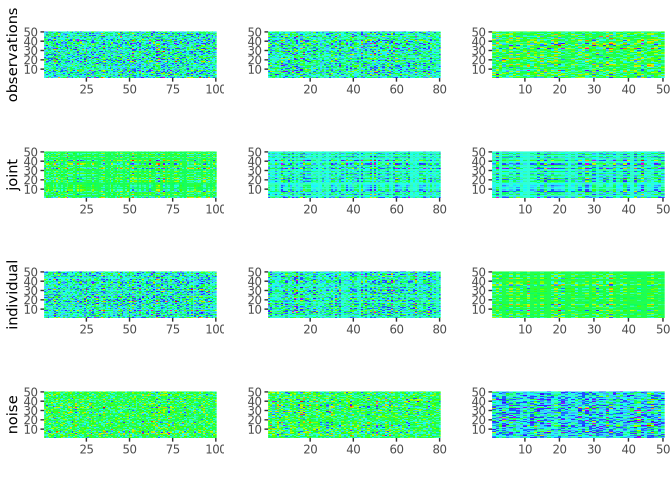
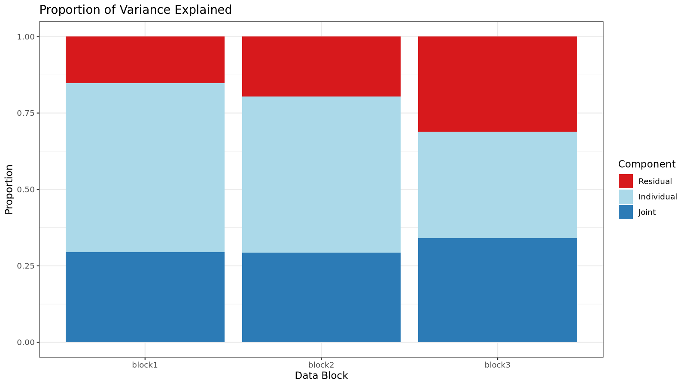
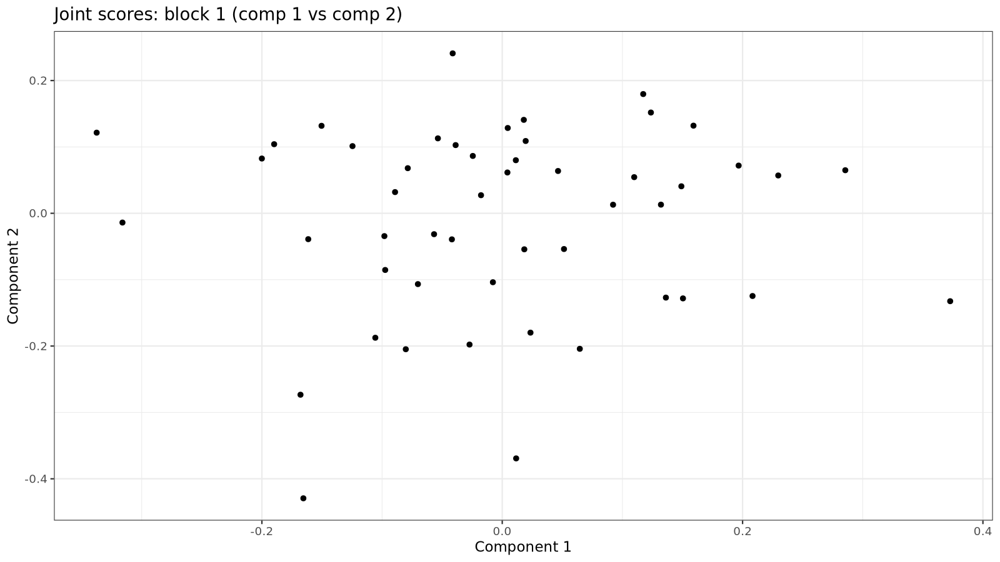
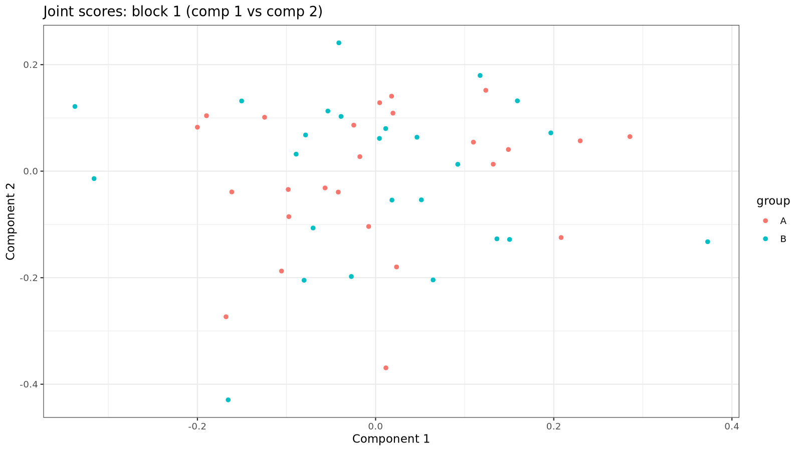
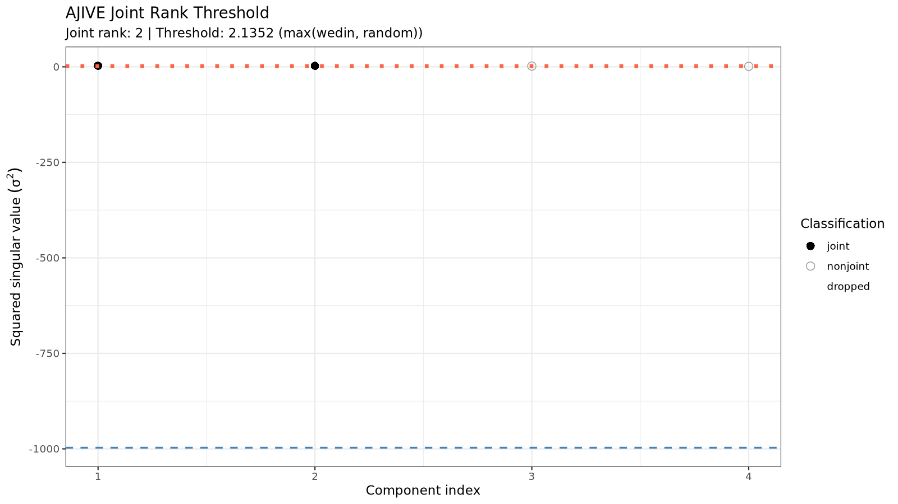
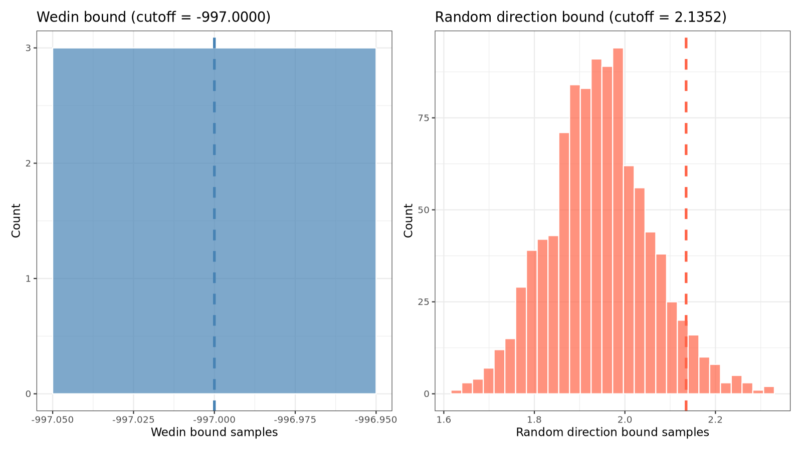
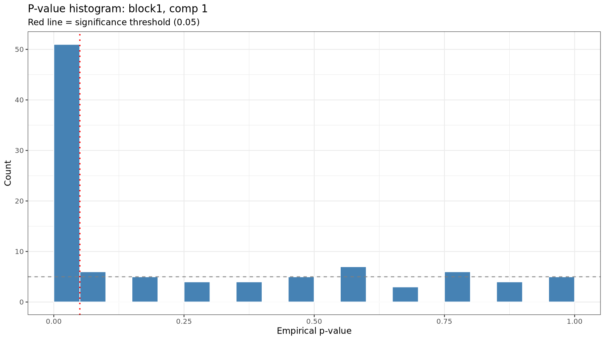
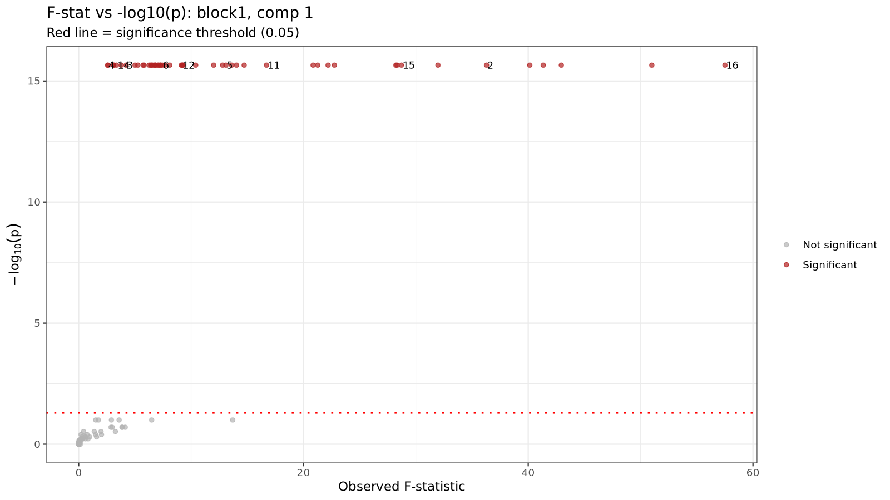
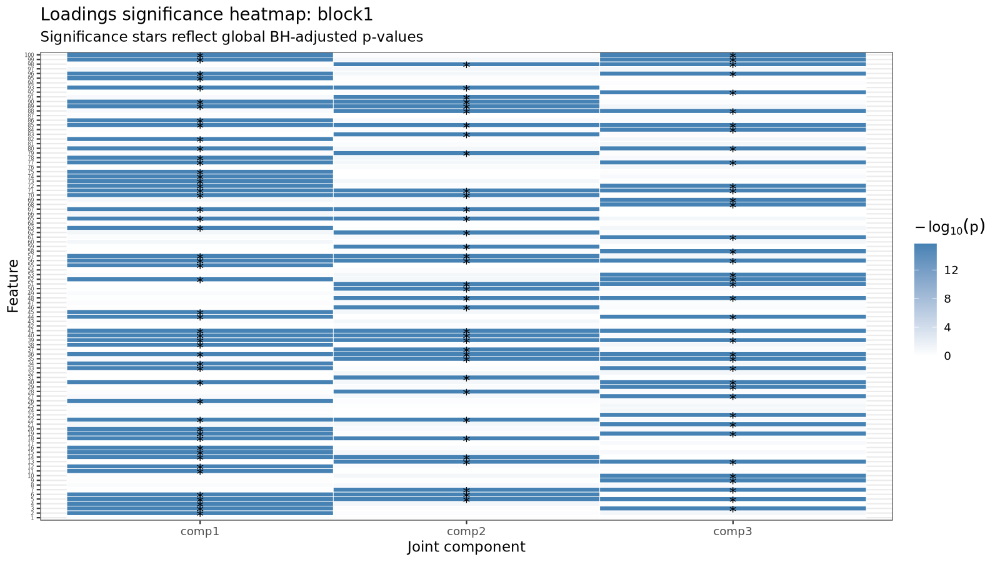

<!-- README.md is generated from README.Rmd. Please edit that file -->

``` r
knitr::opts_chunk$set(
  collapse = TRUE,
  comment = "#>",
  fig.path = "man/figures/README-",
  out.width = "100%"
)
```

# rajiveplus

<!-- badges: start -->

<!-- badges: end -->

rajiveplus (Robust Angle based Joint and Individual Variation Explained)
is a robust alternative to the aJIVE method for the estimation of joint
and individual components in the presence of outliers in multi-source
data. It decomposes the multi-source data into joint, individual and
residual (noise) contributions. The decomposition is robust with respect
to outliers and other types of noises present in the data.

## Installation

You can install the released version of rajiveplus from
[CRAN](https://CRAN.R-project.org) with:

``` r
install.packages("rajiveplus")
```

And the development version from [GitHub](https://github.com/) with:

``` r
# install.packages("devtools")
devtools::install_github("mdmanurung/rajiveplus")
```

## Example

This is a basic example which shows how to use rajiveplus on simple
simulated data:

### Running robust aJIVE

``` r
library(rajiveplus)
## basic example code
n <- 50
pks <- c(100, 80, 50)
Y <- ajive.data.sim(K =3, rankJ = 3, rankA = c(7, 6, 4), n = n,
                   pks = pks, dist.type = 1)

initial_signal_ranks <-  c(7, 6, 4)
data.ajive <- list((Y$sim_data[[1]]), (Y$sim_data[[2]]), (Y$sim_data[[3]]))
ajive.results.robust <- Rajive(data.ajive, initial_signal_ranks)
```

The function returns a list of class `"rajive"` containing the RaJIVE
decomposition, with the joint component (shared across data sources),
individual component (data source specific) and residual component for
each data source.

### Inspecting the decomposition

- Print a concise overview:

``` r
print(ajive.results.robust)
#> RaJIVE Decomposition
#>   Number of blocks : 3
#>   Joint rank       : 3
#>   Individual ranks : 4, 4, 1
```

- Summary table of all ranks:

``` r
summary(ajive.results.robust)
#>   block joint_rank individual_rank
#>  block1          3               4
#>  block2          3               4
#>  block3          3               1
get_all_ranks(ajive.results.robust)
#>    block joint_rank individual_rank
#> 1 block1          3               4
#> 2 block2          3               4
#> 3 block3          3               1
```

- Joint rank:

``` r
get_joint_rank(ajive.results.robust)
#> [1] 3
```

- Individual ranks:

``` r
get_individual_rank(ajive.results.robust, 1)
#> [1] 4
get_individual_rank(ajive.results.robust, 2)
#> [1] 4
get_individual_rank(ajive.results.robust, 3)
#> [1] 1
```

- Shared joint scores (n × joint_rank matrix):

``` r
get_joint_scores(ajive.results.robust)
#>               [,1]         [,2]         [,3]
#>  [1,]  0.005058469 -0.186378503  0.261432847
#>  [2,]  0.142862991  0.067185431  0.031169837
#>  [3,] -0.136094305 -0.231724310 -0.200231320
#>  [4,] -0.171495295 -0.038970290  0.022108422
#>  [5,]  0.033751046  0.269393489 -0.113938219
#>  [6,] -0.154200198  0.087387696 -0.127312308
#>  [7,] -0.162527748  0.049498819  0.023717417
#>  [8,] -0.157090943 -0.012283010  0.068390232
#>  [9,]  0.143172434  0.032381862  0.146284170
#> [10,] -0.018832739 -0.116981764  0.035603283
#> [11,]  0.025410383 -0.331057507 -0.229404275
#> [12,] -0.004064987 -0.007464254 -0.037541577
#> [13,] -0.024784609 -0.057876020 -0.193951086
#> [14,] -0.068932890  0.005555178  0.027066848
#> [15,]  0.234537652  0.188516273 -0.027727814
#> [16,] -0.023363792  0.018048209  0.105643792
#> [17,]  0.143334625 -0.055724211  0.268874600
#> [18,] -0.231584234 -0.073939703  0.074677999
#> [19,]  0.271869564 -0.052124771 -0.021114046
#> [20,] -0.140678916  0.096102294  0.029560783
#> [21,] -0.428161116  0.043568115  0.018579452
#> [22,] -0.074799790  0.101408237  0.032325214
#> [23,] -0.099340770  0.143629332 -0.131517212
#> [24,]  0.055719161  0.366772297  0.097657379
#> [25,] -0.070358261 -0.046868312 -0.206016190
#> [26,]  0.048112165  0.149411125 -0.017736924
#> [27,]  0.135811660  0.135497017 -0.078759156
#> [28,]  0.043463047 -0.030407125 -0.063815733
#> [29,]  0.005577205 -0.029071657 -0.146567606
#> [30,]  0.046966531 -0.118004781  0.067279680
#> [31,] -0.097340117  0.118774642  0.325474643
#> [32,]  0.024242004  0.144958497 -0.104533764
#> [33,]  0.084501047  0.070002947 -0.241717697
#> [34,] -0.305172059  0.055474246 -0.149197803
#> [35,] -0.323397895  0.066637922 -0.112889376
#> [36,] -0.105250488  0.113034948  0.116008115
#> [37,]  0.068291636  0.218658105 -0.137327436
#> [38,] -0.074891772  0.079120943  0.217436082
#> [39,]  0.084612568  0.053866857 -0.051065176
#> [40,] -0.030841615  0.068026849  0.005396369
#> [41,] -0.009237260 -0.063204113  0.105175433
#> [42,] -0.111997399 -0.110969679  0.173076529
#> [43,] -0.130439981  0.346507914 -0.257199905
#> [44,] -0.076034251 -0.093887631 -0.226990543
#> [45,]  0.134157156  0.159360713  0.020243670
#> [46,] -0.102942740 -0.012996600  0.076517832
#> [47,] -0.058488164  0.305149928  0.192939852
#> [48,]  0.160693305  0.060022672 -0.071072635
#> [49,]  0.154641624 -0.020964531 -0.166749167
#> [50,] -0.109657073  0.151085674  0.121110672
```

- Block-specific scores and loadings:

``` r
# Joint scores for block 1
get_block_scores(ajive.results.robust, k = 1, type = "joint")
#>               [,1]         [,2]         [,3]
#>  [1,] -0.034591134 -0.322502594 -0.013862599
#>  [2,] -0.130969103  0.017805032  0.083772956
#>  [3,]  0.105587923  0.037509130 -0.311014065
#>  [4,]  0.161779667 -0.050514308 -0.033895713
#>  [5,]  0.004199810  0.244638951  0.165302045
#>  [6,]  0.168305750  0.145375277 -0.007983539
#>  [7,]  0.168020956 -0.004818268  0.041141007
#>  [8,]  0.149577208 -0.075221234  0.014328065
#>  [9,] -0.141256484 -0.098891582  0.116869974
#> [10,] -0.001139219 -0.093322443 -0.079484877
#> [11,] -0.063176726  0.017953745 -0.396720267
#> [12,]  0.004796456  0.027987631 -0.026741456
#> [13,]  0.024118643  0.131925385 -0.154502699
#> [14,]  0.067677864 -0.024733025  0.013790685
#> [15,] -0.203514934  0.140023591  0.160126853
#> [16,]  0.021017896 -0.082591232  0.070056885
#> [17,] -0.158250711 -0.250494607  0.109661655
#> [18,]  0.216290987 -0.118024416 -0.039401878
#> [19,] -0.276804144  0.008275505 -0.033347563
#> [20,]  0.154785161  0.016050473  0.084689053
#> [21,]  0.430116815 -0.020703814  0.012624333
#> [22,]  0.090750295  0.020901151  0.095744235
#> [23,]  0.119676829  0.182293004  0.040838276
#> [24,] -0.001445005  0.117339121  0.361697602
#> [25,]  0.071622705  0.145178097 -0.155430225
#> [26,] -0.022750986  0.097279691  0.118331080
#> [27,] -0.114028680  0.147845659  0.080877973
#> [28,] -0.044783268  0.041521895 -0.056221300
#> [29,] -0.004818090  0.110481934 -0.102622728
#> [30,] -0.065979562 -0.116860891 -0.058153697
#> [31,]  0.093443623 -0.215698370  0.266547575
#> [32,] -0.002612191  0.167794298  0.066142499
#> [33,] -0.067649376  0.249866213 -0.065280938
#> [34,]  0.315380529  0.137501583 -0.058148732
#> [35,]  0.334833251  0.111000360 -0.030775755
#> [36,]  0.120392216 -0.044704332  0.148083628
#> [37,] -0.037737858  0.238081739  0.113251700
#> [38,]  0.074750574 -0.145863896  0.177043953
#> [39,] -0.072120561  0.077565211  0.023864490
#> [40,]  0.041910543  0.029133277  0.056980531
#> [41,] -0.003569065 -0.124143555  0.003373717
#> [42,]  0.092541094 -0.214395828 -0.007891177
#> [43,]  0.175065360  0.396774496  0.139518896
#> [44,]  0.073742312  0.136281845 -0.206310784
#> [45,] -0.104728568  0.076743722  0.153751891
#> [46,]  0.095555463 -0.079067345  0.022356401
#> [47,]  0.098359022 -0.001945300  0.352885156
#> [48,] -0.146877783  0.102945836  0.024193823
#> [49,] -0.150297169  0.141800072 -0.095066066
#> [50,]  0.132049643 -0.027692040  0.182090639

# Individual loadings for block 2
get_block_loadings(ajive.results.robust, k = 2, type = "individual")
#>               [,1]         [,2]         [,3]         [,4]
#>  [1,]  0.088699427 -0.004693110 -0.023384789 -0.064968653
#>  [2,] -0.018757644 -0.226546747 -0.119668269  0.096375250
#>  [3,]  0.004111496  0.227982760  0.029487411  0.012361964
#>  [4,] -0.013542374 -0.080359031 -0.141838775 -0.085011041
#>  [5,] -0.096552407  0.070679587  0.237661096 -0.013863450
#>  [6,] -0.198126439  0.052581782 -0.106404924 -0.145321972
#>  [7,]  0.005926474 -0.101496637 -0.027842033 -0.169145144
#>  [8,] -0.122606408  0.029310460 -0.052420252 -0.109260465
#>  [9,]  0.023672010  0.179739731 -0.107687350  0.074326831
#> [10,]  0.246588041 -0.096339446  0.006084020  0.011222383
#> [11,]  0.159926538  0.069069867  0.072183483 -0.061331843
#> [12,]  0.018176227  0.210444411  0.119811342 -0.259840243
#> [13,] -0.049068056  0.064092977  0.086351920  0.094605083
#> [14,]  0.061649277  0.178324332  0.033328896 -0.090972419
#> [15,]  0.062685798  0.145468862  0.043637110  0.130866981
#> [16,]  0.097039900 -0.081626846 -0.022100491  0.010034293
#> [17,]  0.073692229  0.157097012 -0.082857649 -0.097837564
#> [18,] -0.036775851 -0.089595551  0.134667359  0.135783702
#> [19,]  0.046977129 -0.017509138 -0.149465474  0.129699488
#> [20,]  0.041810741 -0.025060788  0.120355695  0.040953553
#> [21,]  0.018819883  0.117474327 -0.084767485  0.054026726
#> [22,]  0.171434562 -0.033178546  0.053436477  0.084463997
#> [23,]  0.136888513  0.083219339 -0.082470003 -0.089225569
#> [24,]  0.060514084 -0.001801613 -0.163617278  0.098865225
#> [25,] -0.082080554 -0.081795944 -0.020869722  0.067565723
#> [26,]  0.014457841  0.039174796  0.017324660  0.089300892
#> [27,]  0.234440444 -0.055504433  0.170386895  0.109921876
#> [28,] -0.093636424  0.100305293  0.139740095  0.093090467
#> [29,]  0.015267827 -0.096087807  0.073362026  0.023396972
#> [30,] -0.071489701 -0.100610812 -0.247202447  0.043022926
#> [31,]  0.045236245  0.006718701  0.159631900 -0.130873459
#> [32,] -0.071946758  0.169356520  0.033578426  0.028440182
#> [33,] -0.133733674 -0.083741588  0.097216644 -0.071474714
#> [34,]  0.113477140 -0.004737845 -0.007147803 -0.004752205
#> [35,] -0.069774609 -0.151876064  0.119580087  0.166386681
#> [36,] -0.094484333  0.044879001 -0.090683677  0.090659225
#> [37,]  0.123849269 -0.014932733 -0.069114653  0.078653326
#> [38,] -0.033152442  0.037374363  0.054142661  0.151402511
#> [39,]  0.085344706  0.002280117 -0.104280568 -0.146368939
#> [40,]  0.036573796  0.008077191  0.063282671  0.082120002
#> [41,] -0.113287017  0.088923974 -0.045418611 -0.108363258
#> [42,] -0.207943218 -0.052821342 -0.068797766 -0.083044101
#> [43,]  0.096187363 -0.050588276  0.074868285  0.124481466
#> [44,] -0.234145841 -0.207421591  0.066770143  0.069909225
#> [45,] -0.038208768 -0.100233452  0.061574876 -0.039127715
#> [46,] -0.012662566 -0.144363360  0.109379072 -0.033262968
#> [47,]  0.056172604 -0.077752383 -0.076696945  0.126344262
#> [48,] -0.027846114  0.101199197 -0.003785195 -0.124420569
#> [49,]  0.012915113  0.151220447  0.022039889  0.169845768
#> [50,] -0.243371349 -0.168413307  0.285500945  0.056797725
#> [51,] -0.046736147 -0.210147380  0.095448399  0.065000194
#> [52,]  0.225566749 -0.002497557  0.076514757 -0.149504638
#> [53,]  0.120786723 -0.167934869 -0.022407161 -0.156894791
#> [54,] -0.125637034  0.164466417  0.142075793 -0.081898749
#> [55,]  0.098890856 -0.069320501 -0.072847069 -0.084574919
#> [56,] -0.158150205  0.133715763 -0.014133554 -0.013538017
#> [57,] -0.147861550 -0.026653782 -0.167574264 -0.112459862
#> [58,]  0.020747973  0.120604354 -0.101832449 -0.055142628
#> [59,]  0.041061045  0.184765978  0.286742419  0.055958144
#> [60,]  0.131947861 -0.179893187  0.049013871 -0.092032490
#> [61,]  0.140546498 -0.046404346 -0.208070705  0.074113360
#> [62,]  0.054672291 -0.114609467 -0.021070264  0.166026918
#> [63,] -0.093906068 -0.094513796  0.322094227 -0.164101615
#> [64,] -0.078956175  0.012843970 -0.098692571 -0.077650415
#> [65,] -0.168971940  0.058332651 -0.002789826  0.126852232
#> [66,] -0.071594889 -0.075314628 -0.063742918  0.084965370
#> [67,] -0.046908237 -0.002038319  0.078666331  0.284481812
#> [68,]  0.037711553 -0.002538544  0.080791755  0.118287483
#> [69,] -0.132380010 -0.266847357  0.057990590 -0.065462894
#> [70,]  0.187579236 -0.058829514 -0.092563823  0.066856209
#> [71,]  0.011303287 -0.009949185 -0.002895360 -0.130120352
#> [72,] -0.039221097  0.166181628  0.015564391  0.174934062
#> [73,]  0.227351428 -0.060960302  0.183021829 -0.206480273
#> [74,] -0.060056145 -0.046004664 -0.070964794  0.141162609
#> [75,] -0.143505374 -0.123108512 -0.160303302 -0.103592254
#> [76,] -0.171583807 -0.090056656  0.051655456  0.005883425
#> [77,] -0.069706138 -0.089871771  0.051397658 -0.245880665
#> [78,]  0.077307498 -0.119502716  0.086580647  0.015025136
#> [79,] -0.103581003  0.069173184 -0.013377975 -0.009901383
#> [80,] -0.065450234 -0.086911306 -0.007979162  0.085389603
```

- Full reconstructed matrices (J, I, or E) for a block:

``` r
J1 <- get_block_matrix(ajive.results.robust, k = 1, type = "joint")
I2 <- get_block_matrix(ajive.results.robust, k = 2, type = "individual")
E3 <- get_block_matrix(ajive.results.robust, k = 3, type = "noise")
```

### Visualizing results

- Heatmap decomposition:

``` r
decomposition_heatmaps_robustH(data.ajive, ajive.results.robust)
#> Warning: `aes_string()` was deprecated in ggplot2 3.0.0.
#> ℹ Please use tidy evaluation idioms with `aes()`.
#> ℹ See also `vignette("ggplot2-in-packages")` for more information.
#> ℹ The deprecated feature was likely used in the rajiveplus package.
#>   Please report the issue at <https://github.com/mdmanurung/rajiveplus/issues>.
#> This warning is displayed once per session.
#> Call `lifecycle::last_lifecycle_warnings()` to see where this warning was
#> generated.
```



``` r
knitr::include_graphics("man/figures/README-heatmap-1.png")
```


- Proportion of variance explained (as a list):

``` r
showVarExplained_robust(ajive.results.robust, data.ajive)
#> $Joint
#> [1] 0.3163429 0.4035688 0.4367761
#> 
#> $Indiv
#> [1] 0.4544208 0.4039812 0.2054531
#> 
#> $Resid
#> [1] 0.2292364 0.1924500 0.3577708
```

- Proportion of variance explained (as a bar chart):

``` r
png("man/figures/README-variance-explained.png", width = 1600, height = 900, res = 150)
print(plot_variance_explained(ajive.results.robust, data.ajive))
dev.off()
#> png 
#>   2

```


- Scatter plot of scores (e.g. joint component 1 vs 2 for block 1):

``` r
png("man/figures/README-scores-joint.png", width = 1600, height = 900, res = 150)
print(plot_scores(ajive.results.robust, k = 1, type = "joint",
                  comp_x = 1, comp_y = 2))
dev.off()
#> png 
#>   2

```


``` r

# Colour points by a grouping variable
group_labels <- rep(c("A", "B"), each = n / 2)
png("man/figures/README-scores-joint-grouped.png", width = 1600, height = 900, res = 150)
print(plot_scores(ajive.results.robust, k = 1, type = "joint",
                  comp_x = 1, comp_y = 2, group = group_labels))
dev.off()
#> png 
#>   2

```


### Jackstraw significance testing

After running the RaJIVE decomposition, you can test which variables in
each data block have statistically significantly non-zero joint loadings
using the jackstraw permutation test.

By default, `jackstraw_rajive()` applies global BH correction across all
block/component/feature tests.

``` r
# Run jackstraw test (increase n_null to 50-100 for publication-quality results)
js <- jackstraw_rajive(ajive.results.robust, data.ajive,
                       alpha = 0.05, n_null = 10)

# Print a concise summary table
print(js)
#> JIVE Jackstraw Significance Test
#>   Joint rank: 3   Alpha: 0.05   Correction: BH
#> 
#>   Block      Component    N features     N significant 
#>   ----------------------------------------------------
#>   block1     comp1        100            51            
#>   block1     comp2        100            36            
#>   block1     comp3        100            39            
#>   block2     comp1        80             40            
#>   block2     comp2        80             51            
#>   block2     comp3        80             35            
#>   block3     comp1        50             22            
#>   block3     comp2        50             32            
#>   block3     comp3        50             29

# Get a data frame summary
summary(js)
#>   block component n_features n_significant alpha correction
#>  block1     comp1        100            51  0.05         BH
#>  block1     comp2        100            36  0.05         BH
#>  block1     comp3        100            39  0.05         BH
#>  block2     comp1         80            40  0.05         BH
#>  block2     comp2         80            51  0.05         BH
#>  block2     comp3         80            35  0.05         BH
#>  block3     comp1         50            22  0.05         BH
#>  block3     comp2         50            32  0.05         BH
#>  block3     comp3         50            29  0.05         BH
```

### AJIVE diagnostics and interpretation helpers

The package now includes unified helpers for diagnostics, metadata
association, and bootstrap stability assessment:

``` r
# Extract AJIVE rank diagnostics (wide or long format)
diag_wide <- extract_components(ajive.results.robust, what = "rank_diagnostics")
diag_long <- extract_components(ajive.results.robust, what = "rank_diagnostics", format = "long")
head(diag_long)
#>   component_index obs_sval obs_sval_sq classification joint_rank_estimate
#> 1               1 1.668965    2.785445          joint                   3
#> 2               2 1.622030    2.630981          joint                   3
#> 3               3 1.558970    2.430386          joint                   3
#> 4               4 1.374408    1.888998       nonjoint                   3
#>   overall_sv_sq_threshold wedin_cutoff rand_cutoff
#> 1                2.144075         -997    2.144075
#> 2                2.144075         -997    2.144075
#> 3                2.144075         -997    2.144075
#> 4                2.144075         -997    2.144075

# Unified diagnostic plots
png("man/figures/README-rank-threshold.png", width = 1600, height = 900, res = 150)
print(plot_components(ajive.results.robust, plot_type = "rank_threshold"))
dev.off()
#> png 
#>   2

```


``` r
png("man/figures/README-bound-distributions.png", width = 1600, height = 900, res = 150)
print(plot_components(ajive.results.robust, plot_type = "bound_distributions"))
dev.off()
#> png 
#>   2

```


``` r

# Associate estimated joint scores with sample-level metadata
metadata_df <- data.frame(group = rep(c("A", "B"), each = n / 2))
associate_components(ajive.results.robust, metadata_df,
                     variable = "group", mode = "categorical")
#> [associate_components] NOTE: Component scores are estimated quantities. Score estimation error is NOT propagated into the returned p-values. Treat results as post-decomposition exploratory associations, not exact fixed-design inference (StatisticalAudits.md, Finding 4).
#>   variable component      stat    p_value     p_adj  method
#> 1    group         1 0.3976471 0.52830692 0.6207606 kruskal
#> 2    group         2 2.8823529 0.08955507 0.2686652 kruskal
#> 3    group         3 0.2448000 0.62076059 0.6207606 kruskal

# Bootstrap stability of estimated joint rank
assess_stability(ajive.results.robust, data.ajive, initial_signal_ranks,
                 target = "joint_rank", B = 20)
#> $rank_distribution
#>  [1] 3 3 3 2 2 3 3 3 2 2 3 2 4 4 2 3 3 2 3 3
#> 
#> $rank_table
#> rank_draws
#>  2  3  4 
#>  7 11  2 
#> 
#> $observed_rank
#> [1] 3
```

- Retrieve significant variables for a given block and component:

``` r
get_significant_vars(js, block = 1, component = 1)
#>  [1]   2   3   4   5   6  11  12  14  15  16  18  19  20  22  26  30  33  34  36
#> [20]  38  39  40  41  44  45  52  55  56  57  63  65  67  70  71  72  73  74  75
#> [39]  77  78  80  82  85  86  89  90  93  95  96  99 100
```

- Visualize jackstraw results (three plot types available):

``` r
# P-value histogram
png("man/figures/README-jackstraw-pvalue-hist.png", width = 1600, height = 900, res = 150)
print(plot_jackstraw(js, type = "pvalue_hist", block = 1, component = 1))
dev.off()
#> png 
#>   2

```


``` r

# F-statistic vs -log10(p-value) scatter plot
png("man/figures/README-jackstraw-scatter.png", width = 1600, height = 900, res = 150)
print(plot_jackstraw(js, type = "scatter", block = 1, component = 1))
dev.off()
#> png 
#>   2

```


``` r

# Heatmap of -log10(p-value) across all joint components for one block
png("man/figures/README-jackstraw-loadings-significance.png", width = 1600, height = 900, res = 150)
print(plot_jackstraw(js, type = "loadings_significance", block = 1))
dev.off()
#> png 
#>   2

```


## Function reference

### Core decomposition

| Function | Description |
|----|----|
| `Rajive()` | Run the RaJIVE decomposition on a list of data matrices. Returns an object of class `"rajive"`. |
| `ajive.data.sim()` | Simulate multi-block data with known joint and individual structure for testing and benchmarking. |

### Rank accessors

| Function | Description |
|----|----|
| `get_joint_rank()` | Extract the estimated joint rank from a `"rajive"` object. |
| `get_individual_rank()` | Extract the individual rank for a specific data block. |
| `get_all_ranks()` | Return a `data.frame` of joint and individual ranks for all blocks at once. |

### Component accessors

| Function | Description |
|----|----|
| `get_joint_scores()` | Return the shared n x r_J joint score matrix (r_J = joint rank). |
| `get_block_scores()` | Return the score matrix (U) for a given block and component type (joint or individual). |
| `get_block_loadings()` | Return the loading matrix (V) for a given block and component type. |
| `get_block_matrix()` | Return the full reconstructed matrix (J, I, or E) for a given block and component type. |

### S3 methods for `"rajive"` objects

| Function | Description |
|----|----|
| `print.rajive()` | Print a concise summary of ranks for a `"rajive"` object. |
| `summary.rajive()` | Return and print a `data.frame` of all estimated ranks. |

### Variance explained

| Function | Description |
|----|----|
| `showVarExplained_robust()` | Compute the proportion of variance explained by joint, individual, and residual components for each block (returns a list). |
| `plot_variance_explained()` | Stacked bar chart of variance explained by each component and block. |

### Diagnostics and interpretation

| Function | Description |
|----|----|
| `extract_components()` | Extract AJIVE rank diagnostics in wide-list or long-data-frame format. |
| `plot_components()` | Unified AJIVE diagnostic plotting (`rank_threshold`, `bound_distributions`, `ajive_diagnostic`). |
| `associate_components()` | Test associations between estimated component scores and sample metadata. |
| `assess_stability()` | Bootstrap-based stability assessment for joint rank or loadings (with Procrustes alignment for loadings). |

### Visualisation

| Function | Description |
|----|----|
| `decomposition_heatmaps_robustH()` | Heatmaps of the raw data and the joint, individual, and noise components for all blocks. |
| `plot_scores()` | Scatter plot of two score components for a given block (joint or individual), with optional group colouring. |

### Jackstraw significance testing

| Function | Description |
|----|----|
| `jackstraw_rajive()` | Run the jackstraw permutation test to identify features significantly associated with estimated joint scores. Default multiple-testing correction is global BH across all tests. |
| `print.jackstraw_rajive()` | Print a significance table for a `"jackstraw_rajive"` object. |
| `summary.jackstraw_rajive()` | Return and print a `data.frame` summary of jackstraw results. |
| `get_significant_vars()` | Extract significant variable names/indices for a given block and component from jackstraw results. |
| `plot_jackstraw()` | Diagnostic plots for jackstraw results: p-value histogram, F-stat scatter plot, or loadings significance heatmap. |
