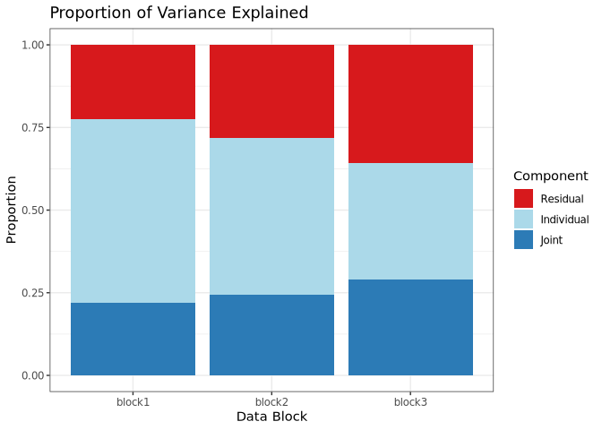
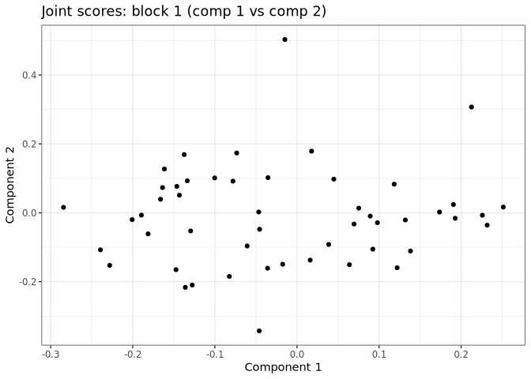
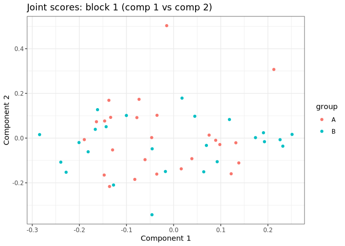
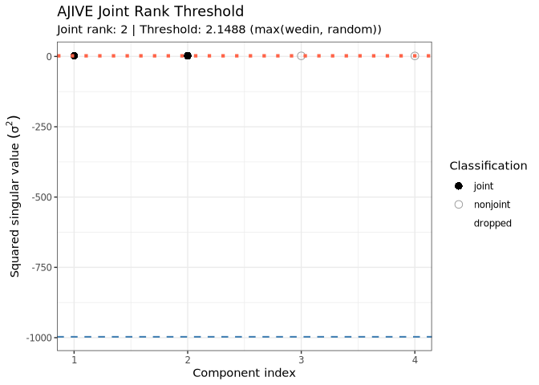
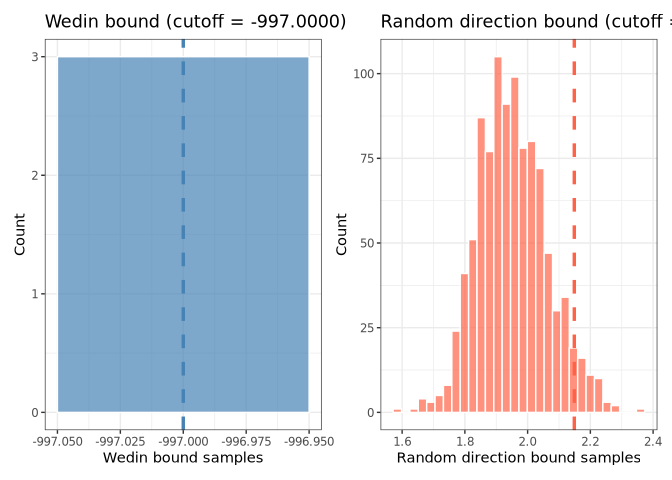
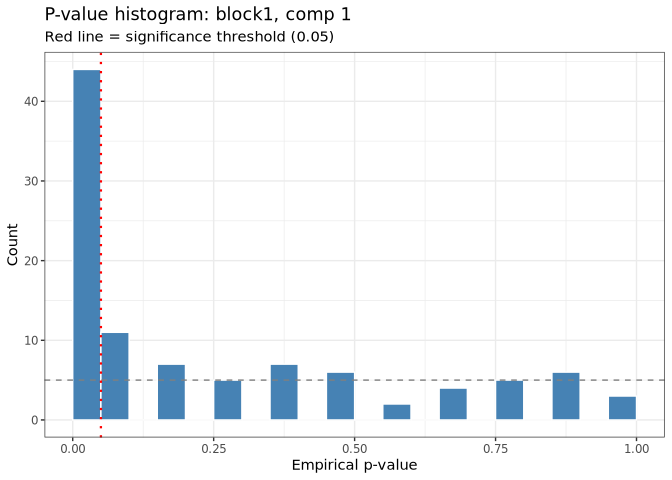
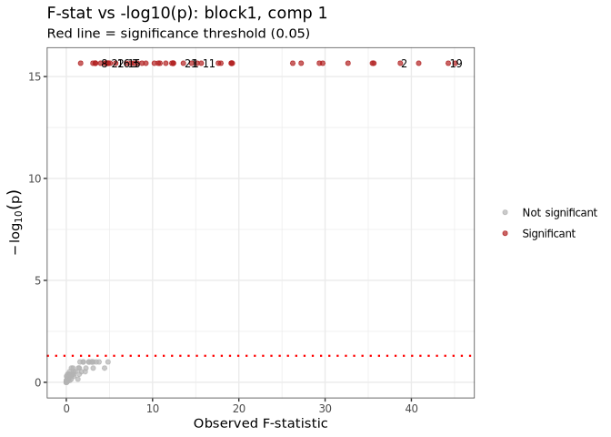
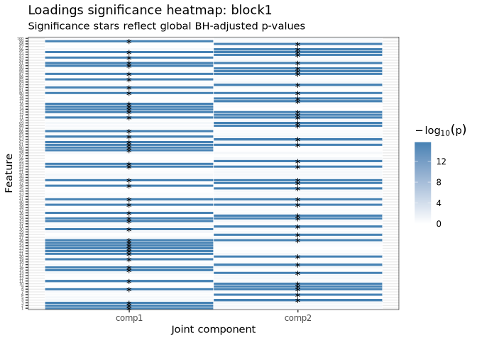

<!-- README.md is generated from README.Rmd. Please edit that file -->

``` r
knitr::opts_chunk$set(
  collapse = TRUE,
  comment = "#>",
  fig.path = "man/figures/README-",
  out.width = "100%"
)
```

# rajiveplus

<!-- badges: start -->

<!-- badges: end -->

rajiveplus (Robust Angle based Joint and Individual Variation Explained)
is a robust alternative to the aJIVE method for the estimation of joint
and individual components in the presence of outliers in multi-source
data. It decomposes the multi-source data into joint, individual and
residual (noise) contributions. The decomposition is robust with respect
to outliers and other types of noises present in the data.

## Installation

You can install the released version of rajiveplus from
[CRAN](https://CRAN.R-project.org) with:

``` r
install.packages("rajiveplus")
```

And the development version from [GitHub](https://github.com/) with:

``` r
# install.packages("devtools")
devtools::install_github("mdmanurung/rajiveplus")
```

## Example

This is a basic example which shows how to use rajiveplus on simple
simulated data:

### Running robust aJIVE

``` r
library(rajiveplus)
## basic example code
n <- 50
pks <- c(100, 80, 50)
Y <- ajive.data.sim(K =3, rankJ = 3, rankA = c(7, 6, 4), n = n,
                   pks = pks, dist.type = 1)

initial_signal_ranks <-  c(7, 6, 4)
data.ajive <- list((Y$sim_data[[1]]), (Y$sim_data[[2]]), (Y$sim_data[[3]]))
ajive.results.robust <- Rajive(data.ajive, initial_signal_ranks)
```

The function returns a list of class `"rajive"` containing the RaJIVE
decomposition, with the joint component (shared across data sources),
individual component (data source specific) and residual component for
each data source.

### Inspecting the decomposition

- Print a concise overview:

``` r
print(ajive.results.robust)
#> RaJIVE Decomposition
#>   Number of blocks : 3
#>   Joint rank       : 2
#>   Individual ranks : 5, 4, 2
```

- Summary table of all ranks:

``` r
summary(ajive.results.robust)
#>   block joint_rank individual_rank
#>  block1          2               5
#>  block2          2               4
#>  block3          2               2
get_all_ranks(ajive.results.robust)
#>    block joint_rank individual_rank
#> 1 block1          2               5
#> 2 block2          2               4
#> 3 block3          2               2
```

- Joint rank:

``` r
get_joint_rank(ajive.results.robust)
#> [1] 2
```

- Individual ranks:

``` r
get_individual_rank(ajive.results.robust, 1)
#> [1] 5
get_individual_rank(ajive.results.robust, 2)
#> [1] 4
get_individual_rank(ajive.results.robust, 3)
#> [1] 2
```

- Shared joint scores (n × joint_rank matrix):

``` r
get_joint_scores(ajive.results.robust)
#>               [,1]          [,2]
#>  [1,] -0.046347732  0.0070728777
#>  [2,] -0.030703334  0.1059351928
#>  [3,] -0.064766453 -0.0904462045
#>  [4,] -0.189748512  0.0126496139
#>  [5,]  0.009842817 -0.1394607410
#>  [6,] -0.088981046 -0.1768791884
#>  [7,] -0.130560343  0.1837562774
#>  [8,]  0.133038426 -0.1255979420
#>  [9,]  0.130463490 -0.0345707422
#> [10,]  0.076144475  0.0056861029
#> [11,]  0.088488030 -0.0189585289
#> [12,] -0.129277817  0.1067079141
#> [13,] -0.073753088  0.1000294013
#> [14,] -0.066641477  0.1815876749
#> [15,] -0.160221451  0.0902985630
#> [16,]  0.095993149 -0.0389273303
#> [17,] -0.132052906 -0.0396054592
#> [18,] -0.154328448 -0.1506095180
#> [19,]  0.115088988 -0.1726588516
#> [20,]  0.034522988 -0.0962554025
#> [21,] -0.002857616  0.5065815296
#> [22,] -0.142687434  0.0918478799
#> [23,] -0.142070946 -0.2033022930
#> [24,] -0.042784851 -0.1577343239
#> [25,]  0.218458541  0.2865092449
#> [26,] -0.024129146 -0.1480852883
#> [27,]  0.225122430 -0.0304476616
#> [28,] -0.133843182 -0.1975596598
#> [29,]  0.067256778 -0.0399268651
#> [30,] -0.053280331 -0.3395599150
#> [31,] -0.155341619  0.1441114755
#> [32,] -0.095594433  0.1118068246
#> [33,] -0.234617371 -0.1296756228
#> [34,] -0.048196231 -0.0432450001
#> [35,]  0.191447278 -0.0359216503
#> [36,]  0.049118677  0.0933645905
#> [37,] -0.201884142  0.0007435662
#> [38,]  0.173630603 -0.0158111810
#> [39,]  0.024512580  0.1775813241
#> [40,] -0.140071257  0.0658476130
#> [41,] -0.183875316 -0.0427060402
#> [42,]  0.229012349 -0.0599989326
#> [43,] -0.243739513 -0.0832622479
#> [44,]  0.087561496 -0.1154164245
#> [45,] -0.163351381  0.0563918357
#> [46,]  0.252114130 -0.0093392671
#> [47,]  0.121951054  0.0711491352
#> [48,]  0.057015455 -0.1577480091
#> [49,]  0.192017463  0.0043549204
#> [50,] -0.282993504  0.0449940454
```

- Block-specific scores and loadings:

``` r
# Joint scores for block 1
get_block_scores(ajive.results.robust, k = 1, type = "joint")
#>              [,1]         [,2]
#>  [1,] -0.04655267  0.002275659
#>  [2,] -0.03525473  0.102029847
#>  [3,] -0.06065297 -0.096427960
#>  [4,] -0.18949176 -0.006855740
#>  [5,]  0.01614549 -0.137439861
#>  [6,] -0.08234911 -0.184778817
#>  [7,] -0.13733114  0.169108678
#>  [8,]  0.13829284 -0.111067991
#>  [9,]  0.13202556 -0.020946153
#> [10,]  0.07531825  0.013424634
#> [11,]  0.08924585 -0.009754572
#> [12,] -0.13361790  0.092703267
#> [13,] -0.07795561  0.091757600
#> [14,] -0.07337743  0.173505253
#> [15,] -0.16376157  0.073243599
#> [16,]  0.09804902 -0.028791240
#> [17,] -0.12952146 -0.052821237
#> [18,] -0.14732275 -0.165327871
#> [19,]  0.12210778 -0.159643826
#> [20,]  0.03866351 -0.092027537
#> [21,] -0.01471582  0.503112234
#> [22,] -0.14632902  0.076577657
#> [23,] -0.13596867 -0.216530416
#> [24,] -0.03576825 -0.160980762
#> [25,]  0.21262587  0.307146425
#> [26,] -0.01741018 -0.149483085
#> [27,]  0.22585531 -0.007178619
#> [28,] -0.12750292 -0.209963517
#> [29,]  0.06954743 -0.032720699
#> [30,] -0.04592894 -0.342919572
#> [31,] -0.16145481  0.127159903
#> [32,] -0.10022453  0.101215357
#> [33,] -0.22810199 -0.152755637
#> [34,] -0.04552080 -0.047839181
#> [35,]  0.19274442 -0.016050581
#> [36,]  0.04491700  0.097723099
#> [37,] -0.20075655 -0.019904365
#> [38,]  0.17368031  0.002072272
#> [39,]  0.01781706  0.178865778
#> [40,] -0.14317884  0.051005225
#> [41,] -0.18134409 -0.061217967
#> [42,]  0.23170829 -0.036088327
#> [43,] -0.23939433 -0.107617420
#> [44,]  0.09242754 -0.105618926
#> [45,] -0.16618792  0.039224548
#> [46,]  0.25127116  0.016515392
#> [47,]  0.11842532  0.083120014
#> [48,]  0.06391057 -0.150769379
#> [49,]  0.19060482  0.023951956
#> [50,] -0.28436630  0.015687905

# Individual loadings for block 2
get_block_loadings(ajive.results.robust, k = 2, type = "individual")
#>                [,1]          [,2]          [,3]         [,4]
#>  [1,]  0.0117946543 -0.0008384582 -0.1117394236  0.083053460
#>  [2,] -0.1042585928 -0.2391128197  0.0652970179  0.029360168
#>  [3,]  0.0991134697 -0.2072444315 -0.1818950094 -0.005066256
#>  [4,] -0.0711279628  0.1053885637 -0.0712598236  0.182457838
#>  [5,]  0.0820733666  0.0856725696  0.1059511838 -0.001817890
#>  [6,] -0.1082826876  0.1565450217  0.0799835082 -0.288983032
#>  [7,]  0.0281523301  0.0112754578  0.0794251422 -0.113069637
#>  [8,] -0.1762945386  0.0902999836 -0.2838559082  0.032093690
#>  [9,] -0.0090869359 -0.1325929189 -0.0494265219  0.188083648
#> [10,] -0.1136423194  0.0533031070 -0.0023902013  0.041350798
#> [11,] -0.0024059138 -0.0267108559  0.0625220320  0.133020429
#> [12,]  0.0530379607  0.0351198727  0.0975917097 -0.049045627
#> [13,] -0.0527831190 -0.0629905129  0.0956461301 -0.113860849
#> [14,] -0.1765407247 -0.1053677895  0.0245138360  0.244445343
#> [15,] -0.0819152422  0.0673538556  0.0813564282 -0.141341875
#> [16,]  0.1071604071 -0.1077237659  0.0149688034  0.121986474
#> [17,]  0.0011985670 -0.0851744538  0.1012836833  0.054794503
#> [18,] -0.3278146640 -0.0819066291  0.0013901545  0.058210002
#> [19,] -0.0395528708  0.0049812450 -0.0844521261  0.096129036
#> [20,] -0.1205419117 -0.0783334951 -0.1618869458  0.046860562
#> [21,] -0.3149905869 -0.0992947648  0.0608643203  0.029262153
#> [22,]  0.0924578360  0.0698568517  0.2309767781 -0.008067816
#> [23,]  0.0424153749  0.1130021963  0.0150948918  0.087895900
#> [24,]  0.1496985294 -0.0282036480 -0.2717509573 -0.079458850
#> [25,]  0.0360667313 -0.1045929943  0.0475561360  0.010989166
#> [26,] -0.0958110735  0.1921412345  0.1208517207  0.011624253
#> [27,]  0.0176459537  0.0399249025 -0.1284309609  0.042524806
#> [28,] -0.2600963385  0.1540667158  0.0271700893  0.177834045
#> [29,] -0.0714862595  0.0299552563  0.1627449520  0.061378203
#> [30,] -0.1713607750 -0.0922163589  0.0103239553 -0.010403704
#> [31,] -0.0992447130  0.0652347788  0.0129655943  0.010356525
#> [32,]  0.0476492946  0.0590327049 -0.0016474836  0.030182012
#> [33,] -0.0107283988  0.0504883003  0.0337683417 -0.003526925
#> [34,] -0.0004612551 -0.1142048256 -0.1797891239 -0.054748378
#> [35,]  0.0205798433  0.0266060717 -0.0797790672  0.159569912
#> [36,]  0.1888019266 -0.0887350126  0.0842091939  0.235721438
#> [37,]  0.0171010420  0.1395450261 -0.0497724567 -0.060107020
#> [38,] -0.0274738367 -0.1430150646  0.1193611106 -0.002153750
#> [39,]  0.0540003730 -0.0119113487  0.0733638718  0.267247646
#> [40,]  0.2560843580 -0.0094376151 -0.0460272236  0.047636602
#> [41,]  0.1291510433  0.1989975544 -0.0347404132 -0.230113883
#> [42,]  0.0940221098 -0.0340971194 -0.1616961083 -0.031072577
#> [43,]  0.1363027314  0.3485101049  0.0963293168  0.153854307
#> [44,] -0.0947235417  0.2210699322  0.0261294807 -0.037623385
#> [45,]  0.0525063993 -0.0174054628  0.2393611351 -0.052388855
#> [46,]  0.0426884210 -0.1311975505 -0.0498574058  0.063572911
#> [47,] -0.0070287529 -0.0227741666 -0.1033622337 -0.055176745
#> [48,] -0.0003470855 -0.2040582799  0.1114240156 -0.003598236
#> [49,] -0.0948908143  0.0762572509 -0.1327006697  0.029170895
#> [50,]  0.0300415597 -0.2584744498  0.0620540310 -0.178547715
#> [51,]  0.0408261384  0.0376107189  0.1636973849  0.115004217
#> [52,]  0.1183637104  0.0073475179  0.0687512999  0.050049425
#> [53,] -0.0860988458  0.1084473976  0.0009171578 -0.010959013
#> [54,] -0.0475696295 -0.0795135107  0.0896056482 -0.088895710
#> [55,]  0.0873042540 -0.1632542083 -0.1572251906 -0.074102965
#> [56,] -0.0580077415  0.0492803395 -0.0493988817  0.217528407
#> [57,] -0.0446253610  0.0620800649 -0.0134990177  0.116367938
#> [58,] -0.1111284925 -0.0589630857  0.1641733158  0.063044186
#> [59,] -0.1998960407 -0.0017621233 -0.0618002558  0.017121807
#> [60,]  0.1161610314  0.1054757093  0.0092666825  0.171694231
#> [61,] -0.2169159716 -0.0446152852  0.0268970446 -0.146048514
#> [62,]  0.0113614279  0.0819003525 -0.1351231247  0.056146931
#> [63,]  0.0343578658  0.0598767246  0.1897734372 -0.241601270
#> [64,] -0.1790568016  0.1489519803 -0.1122909744 -0.142329762
#> [65,] -0.0556283448 -0.0153644096  0.0024909959 -0.112674485
#> [66,]  0.0122016115 -0.0598197739 -0.2014190982 -0.071770437
#> [67,] -0.1202838482 -0.0105295092 -0.0624566948  0.030328410
#> [68,] -0.1480506919 -0.1178435746  0.1308351442 -0.017462023
#> [69,]  0.1334981683  0.1305399928 -0.1362974944 -0.119916670
#> [70,] -0.1595489959  0.0531548045 -0.0167731059  0.001089082
#> [71,] -0.0332975534 -0.0930452072 -0.0965329121  0.068546216
#> [72,]  0.1000243020  0.0264617497  0.1353268055  0.188106107
#> [73,]  0.0093366895 -0.0570662011 -0.1280795781  0.050222061
#> [74,]  0.0109844558 -0.1820893211 -0.0194294602 -0.019939341
#> [75,] -0.0140030269 -0.0093726692 -0.0276762780  0.005710904
#> [76,] -0.0285876634 -0.0173633597  0.1227738496  0.012347414
#> [77,] -0.0082299560  0.0240748002 -0.0634706261 -0.099663519
#> [78,]  0.1434961732 -0.1931343396  0.1278892689  0.032285111
#> [79,] -0.0051870033 -0.1414248146 -0.0309989924 -0.003767685
#> [80,]  0.0377138568 -0.0727798426  0.1797353383 -0.167171224
```

- Full reconstructed matrices (J, I, or E) for a block:

``` r
J1 <- get_block_matrix(ajive.results.robust, k = 1, type = "joint")
I2 <- get_block_matrix(ajive.results.robust, k = 2, type = "individual")
E3 <- get_block_matrix(ajive.results.robust, k = 3, type = "noise")
```

### Visualizing results

- Heatmap decomposition:

``` r
decomposition_heatmaps_robustH(data.ajive, ajive.results.robust)
#> Warning: `aes_string()` was deprecated in ggplot2 3.0.0.
#> ℹ Please use tidy evaluation idioms with `aes()`.
#> ℹ See also `vignette("ggplot2-in-packages")` for more information.
#> ℹ The deprecated feature was likely used in the rajiveplus package.
#>   Please report the issue at <https://github.com/mdmanurung/rajiveplus/issues>.
#> This warning is displayed once per session.
#> Call `lifecycle::last_lifecycle_warnings()` to see where this warning was
#> generated.
```


- Proportion of variance explained (as a list):

``` r
showVarExplained_robust(ajive.results.robust, data.ajive)
#> $Joint
#> [1] 0.2192265 0.2436978 0.2891104
#> 
#> $Indiv
#> [1] 0.5562614 0.4743168 0.3543116
#> 
#> $Resid
#> [1] 0.2245121 0.2819855 0.3565779
```

- Proportion of variance explained (as a bar chart):

``` r
plot_variance_explained(ajive.results.robust, data.ajive)
```



- Scatter plot of scores (e.g. joint component 1 vs 2 for block 1):

``` r
plot_scores(ajive.results.robust, k = 1, type = "joint",
            comp_x = 1, comp_y = 2)
```



``` r

# Colour points by a grouping variable
group_labels <- rep(c("A", "B"), each = n / 2)
plot_scores(ajive.results.robust, k = 1, type = "joint",
            comp_x = 1, comp_y = 2, group = group_labels)
```



### Jackstraw significance testing

After running the RaJIVE decomposition, you can test which variables in
each data block have statistically significantly non-zero joint loadings
using the jackstraw permutation test.

By default, `jackstraw_rajive()` applies global BH correction across all
block/component/feature tests.

``` r
# Run jackstraw test (increase n_null to 50-100 for publication-quality results)
js <- jackstraw_rajive(ajive.results.robust, data.ajive,
                       alpha = 0.05, n_null = 10)

# Print a concise summary table
print(js)
#> JIVE Jackstraw Significance Test
#>   Joint rank: 2   Alpha: 0.05   Correction: BH
#> 
#>   Block      Component    N features     N significant 
#>   ----------------------------------------------------
#>   block1     comp1        100            44            
#>   block1     comp2        100            39            
#>   block2     comp1        80             35            
#>   block2     comp2        80             38            
#>   block3     comp1        50             24            
#>   block3     comp2        50             25

# Get a data frame summary
summary(js)
#>   block component n_features n_significant alpha correction
#>  block1     comp1        100            44  0.05         BH
#>  block1     comp2        100            39  0.05         BH
#>  block2     comp1         80            35  0.05         BH
#>  block2     comp2         80            38  0.05         BH
#>  block3     comp1         50            24  0.05         BH
#>  block3     comp2         50            25  0.05         BH
```

### AJIVE diagnostics and interpretation helpers

The package now includes unified helpers for diagnostics, metadata
association, and bootstrap stability assessment:

``` r
# Extract AJIVE rank diagnostics (wide or long format)
diag_wide <- extract_components(ajive.results.robust, what = "rank_diagnostics")
diag_long <- extract_components(ajive.results.robust, what = "rank_diagnostics", format = "long")
head(diag_long)
#>   component_index obs_sval obs_sval_sq classification joint_rank_estimate
#> 1               1 1.633604    2.668660          joint                   2
#> 2               2 1.562126    2.440237          joint                   2
#> 3               3 1.461065    2.134711       nonjoint                   2
#> 4               4 1.390467    1.933398       nonjoint                   2
#>   overall_sv_sq_threshold wedin_cutoff rand_cutoff
#> 1                2.148775         -997    2.148775
#> 2                2.148775         -997    2.148775
#> 3                2.148775         -997    2.148775
#> 4                2.148775         -997    2.148775

# Unified diagnostic plots
plot_components(ajive.results.robust, plot_type = "rank_threshold")
```



``` r
plot_components(ajive.results.robust, plot_type = "bound_distributions")
```



``` r

# Associate estimated joint scores with sample-level metadata
metadata_df <- data.frame(group = rep(c("A", "B"), each = n / 2))
associate_components(ajive.results.robust, metadata_df,
                     variable = "group", mode = "categorical")
#> [associate_components] NOTE: Component scores are estimated quantities. Score estimation error is NOT propagated into the returned p-values. Treat results as post-decomposition exploratory associations, not exact fixed-design inference (StatisticalAudits.md, Finding 4).
#>   variable component       stat   p_value     p_adj  method
#> 1    group         1 0.02117647 0.8842992 0.8842992 kruskal
#> 2    group         2 0.24480000 0.6207606 0.8842992 kruskal

# Bootstrap stability of estimated joint rank
assess_stability(ajive.results.robust, data.ajive, initial_signal_ranks,
                 target = "joint_rank", B = 20)
#> $rank_distribution
#>  [1] 2 3 3 3 2 3 3 2 2 2 3 3 2 3 2 3 2 2 3 3
#> 
#> $rank_table
#> rank_draws
#>  2  3 
#>  9 11 
#> 
#> $observed_rank
#> [1] 2
```

- Retrieve significant variables for a given block and component:

``` r
get_significant_vars(js, block = 1, component = 1)
#>  [1]  1  2  3  8 11 15 16 19 21 22 23 24 25 26 30 33 34 36 39 41 46 48 53 54 59
#> [26] 60 61 62 64 66 71 73 74 75 76 80 82 85 87 90 91 93 95 99
```

- Visualize jackstraw results (three plot types available):

``` r
# P-value histogram
plot_jackstraw(js, type = "pvalue_hist", block = 1, component = 1)
```



``` r

# F-statistic vs -log10(p-value) scatter plot
plot_jackstraw(js, type = "scatter", block = 1, component = 1)
```



``` r

# Heatmap of -log10(p-value) across all joint components for one block
plot_jackstraw(js, type = "loadings_significance", block = 1)
```



## Function reference

### Core decomposition

| Function | Description |
|----|----|
| `Rajive()` | Run the RaJIVE decomposition on a list of data matrices. Returns an object of class `"rajive"`. |
| `ajive.data.sim()` | Simulate multi-block data with known joint and individual structure for testing and benchmarking. |

### Rank accessors

| Function | Description |
|----|----|
| `get_joint_rank()` | Extract the estimated joint rank from a `"rajive"` object. |
| `get_individual_rank()` | Extract the individual rank for a specific data block. |
| `get_all_ranks()` | Return a `data.frame` of joint and individual ranks for all blocks at once. |

### Component accessors

| Function | Description |
|----|----|
| `get_joint_scores()` | Return the shared n x r_J joint score matrix (r_J = joint rank). |
| `get_block_scores()` | Return the score matrix (U) for a given block and component type (joint or individual). |
| `get_block_loadings()` | Return the loading matrix (V) for a given block and component type. |
| `get_block_matrix()` | Return the full reconstructed matrix (J, I, or E) for a given block and component type. |

### S3 methods for `"rajive"` objects

| Function | Description |
|----|----|
| `print.rajive()` | Print a concise summary of ranks for a `"rajive"` object. |
| `summary.rajive()` | Return and print a `data.frame` of all estimated ranks. |

### Variance explained

| Function | Description |
|----|----|
| `showVarExplained_robust()` | Compute the proportion of variance explained by joint, individual, and residual components for each block (returns a list). |
| `plot_variance_explained()` | Stacked bar chart of variance explained by each component and block. |

### Diagnostics and interpretation

| Function | Description |
|----|----|
| `extract_components()` | Extract AJIVE rank diagnostics in wide-list or long-data-frame format. |
| `plot_components()` | Unified AJIVE diagnostic plotting (`rank_threshold`, `bound_distributions`, `ajive_diagnostic`). |
| `associate_components()` | Test associations between estimated component scores and sample metadata. |
| `assess_stability()` | Bootstrap-based stability assessment for joint rank or loadings (with Procrustes alignment for loadings). |

### Visualisation

| Function | Description |
|----|----|
| `decomposition_heatmaps_robustH()` | Heatmaps of the raw data and the joint, individual, and noise components for all blocks. |
| `plot_scores()` | Scatter plot of two score components for a given block (joint or individual), with optional group colouring. |

### Jackstraw significance testing

| Function | Description |
|----|----|
| `jackstraw_rajive()` | Run the jackstraw permutation test to identify features significantly associated with estimated joint scores. Default multiple-testing correction is global BH across all tests. |
| `print.jackstraw_rajive()` | Print a significance table for a `"jackstraw_rajive"` object. |
| `summary.jackstraw_rajive()` | Return and print a `data.frame` summary of jackstraw results. |
| `get_significant_vars()` | Extract significant variable names/indices for a given block and component from jackstraw results. |
| `plot_jackstraw()` | Diagnostic plots for jackstraw results: p-value histogram, F-stat scatter plot, or loadings significance heatmap. |
